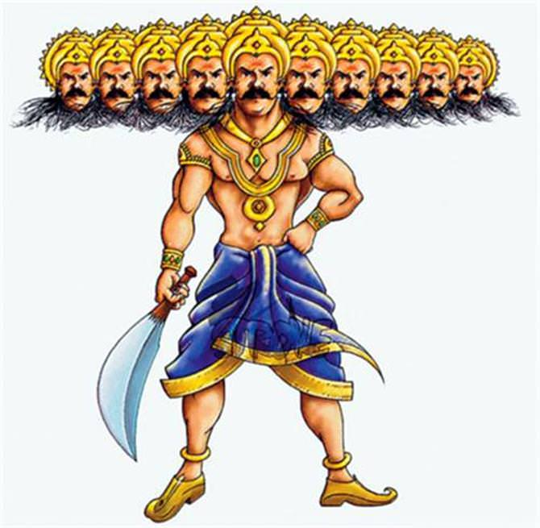
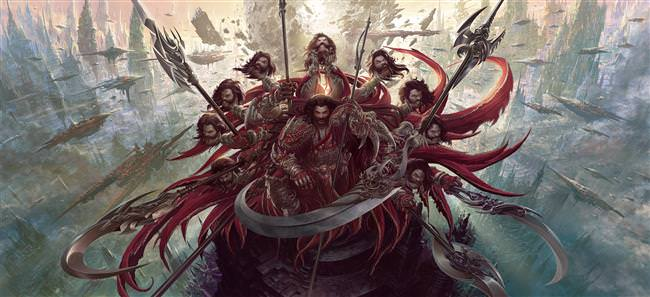
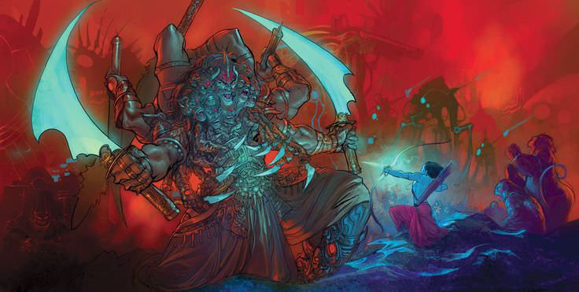
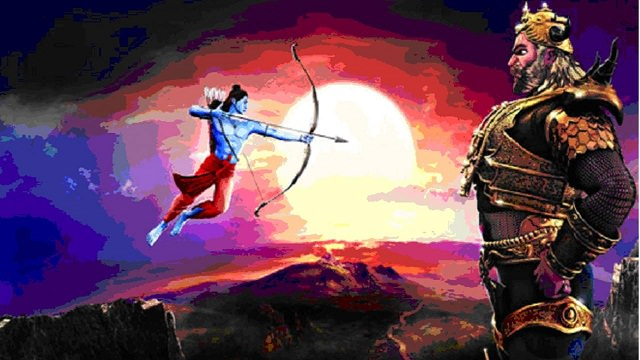

# Ramayan (A tale of Ram)

According to Hindu scriptures, Lord Ram was born on the the day of Ram Navami. After the increase of iniquity, Lord Bishnu, who came to earth as "Ram", killed Ravana. But many do not know that Ravan's death was possible due to a small mistake. Else, even Lord Ram could not have killed him.

## Ravan invited his death due to his small mistake
King of Lanka "Ravan" wanted to conquer the whole world. But he knew that his dream could not come true without god's blessings. So he began to do great penance to please hus anestor god Brahma.

Even after so many years of penance, Brahma was not pleased and thus didnot appear before Ravan. Then Ravan began to intensify his penance. He cut off his head and began to offer it to Brahma. As, Ravan was the son of Brahma, he used to grow as many heads as he could.

After Ravan cut off his 10 heads and offered them, Brahmaji was pleased and appeared before Ravan. Brahma said -" Oh my child! I am pleased with your hard work. What blessings do you want from me? Ask!"

Inorder to conquer the world, Ravan asked Brahma for the gift of immortality,but Brahma said- 
 >*"Death is certain, my  child!". You must die after being born into this world. So I am unable to give you the blessing of immortality. You may ask for something else!"*

Then the ambitiuos Ravan said- 
>*"O Brahma, May no god or heavenly spirit kill me. Oh Lord! may no demon, monster or beast defaet me! Give me the blessing of victory over all these!" Brahma also said, "Tathasthu! and he disappeared.*

Blinded by his power and might, the foolish Ravan thought no mankind could harm him. Man is like a hunt for him, which can be easily trampled and defeated. His mistake was that he considered mankind weak. That is why Shri Ram was able to cut of all his 10 head and kill him ruthlessly.

## Conclusion

No one should boast about his powers and consider others weak. Even a small ant can cause the death of such a huge elephant. Nature plays its own game. It is unparallelled. Mighty lion, The king of the jungle, cannot be defeated by anyone else, but he is preyed  upon by small flies and insects.
<<<<<<< HEAD
   
=======
   
>>>>>>> corrections
